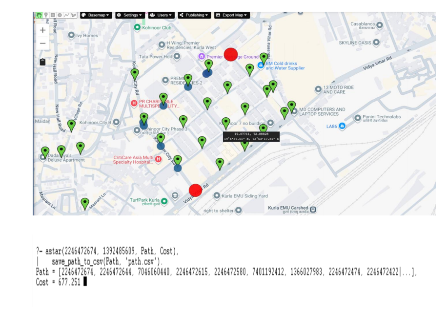

# Route Finder

A graph-based pathfinding application that computes the shortest route between two locations using the **A\*** search algorithm on real-world road network data extracted from **OpenStreetMap**.

The project integrates **Python** for geographic data extraction and preprocessing with **SWI-Prolog** for graph representation and heuristic pathfinding.

---

## Output

<p align="center">
  
</p>

The image above shows the shortest route computed by the A* algorithm between two selected locations on the Chembur road network. The application also exports the resulting path as a CSV file for further processing or visualization.

---

## Features

- Extracts real-world road network data from OpenStreetMap
- Converts map data into graph structures
- Loads graph data into SWI-Prolog
- Computes shortest routes using the A* search algorithm
- Uses Euclidean distance as the heuristic function
- Exports the computed path as a CSV file
- Modular architecture separating preprocessing and pathfinding

---

## Technologies Used

| Technology | Purpose |
|------------|---------|
| Python | Data extraction & preprocessing |
| OSMnx | Download OpenStreetMap road network |
| NetworkX | Graph generation |
| Pandas | CSV processing |
| SWI-Prolog | Graph representation & pathfinding |
| A* Algorithm | Shortest path computation |

---

## Project Workflow

### 1. Road Network Extraction

The project begins by defining a bounding box around **Chembur, Mumbai**.

Using **OSMnx**, the application downloads the drivable road network directly from OpenStreetMap. Each road intersection becomes a graph node, while every road segment becomes a weighted edge.

---

### 2. Data Preprocessing

The downloaded graph is converted into two CSV files.

#### Node Dataset

| Field | Description |
|--------|-------------|
| `node_id` | Unique OpenStreetMap node ID |
| `latitude` | Latitude coordinate |
| `longitude` | Longitude coordinate |

#### Edge Dataset

| Field | Description |
|--------|-------------|
| `source` | Starting node |
| `destination` | Ending node |
| `length` | Distance between nodes (meters) |

The processed data is exported as:

- `prolog_nodes.csv`
- `prolog_edges.csv`

---

### 3. Graph Construction in SWI-Prolog

The CSV files are imported using `csv_read_file/3`.

Each road intersection is represented as:

```prolog
node(ID, Latitude, Longitude).
```

Each road segment is represented as:

```prolog
edge(Source, Destination, Cost).
```

Roads are treated as **bidirectional**, so reverse edges are automatically created while loading the graph.

---

### 4. A* Search Algorithm

The algorithm initializes with:

- Source node
- Destination node
- Open list
- Closed list

Each candidate node is evaluated using

```
f(n) = g(n) + h(n)
```

where

- **g(n)** = Distance travelled from the source
- **h(n)** = Euclidean distance to the destination

The node with the lowest **f(n)** value is expanded until the destination is reached.

Once the goal node is found, the algorithm reconstructs the complete shortest path.

---

### 5. Output Generation

The final route is exported as

```
path.csv
```

The generated CSV contains

| Field | Description |
|--------|-------------|
| `node_id` | Node identifier |
| `latitude` | Latitude |
| `longitude` | Longitude |

This file can be used for visualization or integration with other mapping tools.

---

## Project Structure

```text
Route_Finder/
│── City_Graph.py
│── loader.pl
│── astar.pl
│── prolog_nodes.csv
│── prolog_edges.csv
│── path.csv
│── output.png
│── README.md
```

---

## Running the Project

### Prerequisites

- Python 3.x
- SWI-Prolog

### Install Dependencies

```bash
pip install osmnx networkx pandas matplotlib
```

### Generate Graph Data

```bash
python City_Graph.py
```

### Load Data into SWI-Prolog

```prolog
?- [loader].
?- load_data('prolog_nodes.csv', 'prolog_edges.csv').
?- [astar].
```

### Run A*

```prolog
?- astar(StartNode, GoalNode, Path, Cost).
```

The computed shortest path is automatically saved as `path.csv`.

---

## Algorithm Complexity

| Operation | Complexity |
|-----------|------------|
| Graph Construction | O(V + E) |
| A* Search | O(E log V) (using a priority queue) |
| Path Reconstruction | O(V) |

where:

- **V** = Number of vertices
- **E** = Number of edges

---

## Future Improvements

- Interactive graphical user interface
- Real-time traffic integration
- Multiple routing algorithms (Dijkstra, Bellman-Ford)
- Turn-by-turn navigation
- Interactive map visualization
- Support for larger geographic regions

---

## Author

**Shreyansh Verma**

GitHub: https://github.com/shreyanshverma498-sudo
